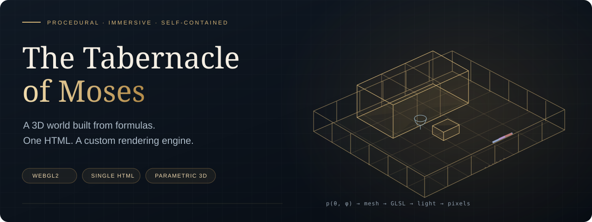
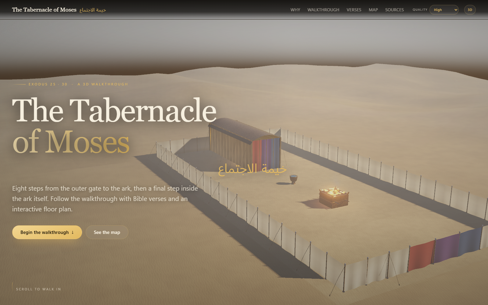
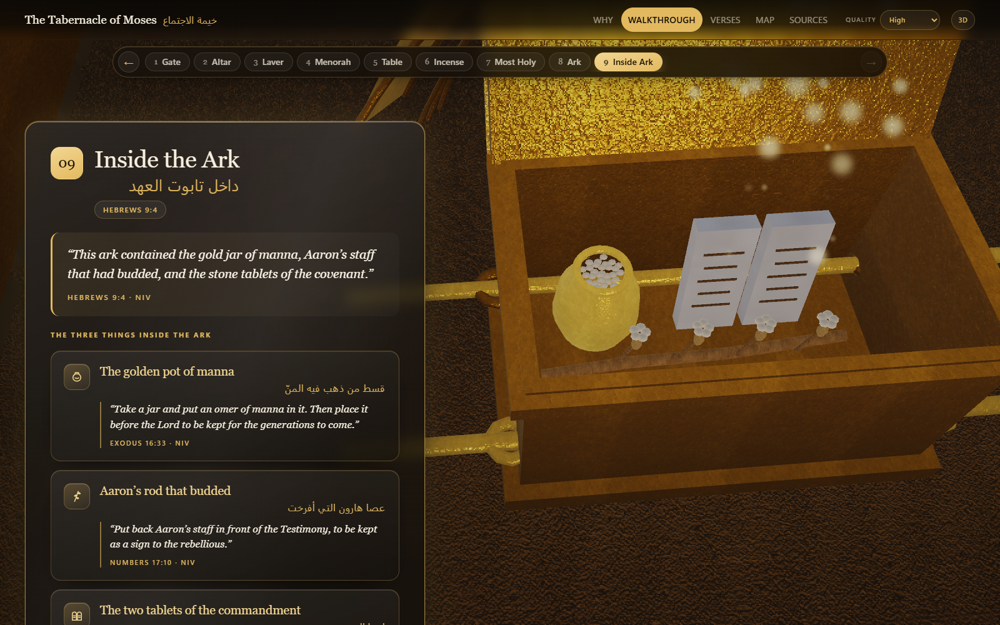

<p align="center">
  
</p>

<p align="center">
  <a href="https://github.com/Fredy-E/The-Tabernacle-of-Moses/actions/workflows/verify.yml"></a>
  
  
  
  
</p>

<p align="center"><a href="https://the-tabernacle-of-moses.vercel.app"><strong>Explore the live walkthrough</strong></a> · <a href="docs/ARCHITECTURE.md">Inside the renderer</a> · <a href="docs/MATH.md">The mathematics</a></p>

# A 3D world, built from formulas

The Tabernacle of Moses is a continuous, scroll-driven journey through a procedurally constructed sanctuary. Move from the courtyard gate to the ark, then look inside it. The geometry, camera, materials, particles, shaders, text, and interactive map all live in **one self-contained `index.html`**.

There are no downloaded models, runtime libraries, scene engine packages, or external asset requests. JavaScript builds the mesh from parametric surfaces; GLSL renders it through a custom WebGL2 pipeline. TypeScript powers the development browser tests. The shipped page runs directly in a browser without a build step.



## What makes it interesting

| System | Implementation |
| --- | --- |
| Procedural geometry | Boxes, cylinders, spheres, tori, surfaces of revolution, and tubes along curved paths |
| Camera flight | Twelve authored poses connected by scroll anchors, quintic easing, and time-based damping |
| Moving surfaces | GPU-deformed gate panels, tent entrance, inner veil, and hinged ark cover |
| Materials | Procedural patterns; an embedded six-layer texture atlas decoded only in High quality |
| Lighting | Metallic/roughness microfacet shading, filtered shadows, ambient reflections, exposure, and bloom |
| Visibility | Exterior and interior room batches selected through projected door apertures |
| Performance | Adaptive render resolution, particle budgets, quality profiles, and a software-rendering frame cap |
| Navigation | Nine steps, synchronized scroll tracking, keyboard arrows, and a clickable SVG floor plan |
| Presentation | English and Arabic labels, 33 NIV quotation blocks, mobile layout, reduced motion, and print styles |

**43,196 vertices · 56,268 triangles · 12 camera poses · 9 walkthrough steps**

Geometry counts come from the renderer verification suite. Room culling reduces submitted geometry; it does not imply a measured frame-rate improvement on every device.



## Open it

Download or clone the repository, then open `index.html` in a modern browser. It works offline because the material atlas and all executable page code are embedded. WebGL2 enables the 3D background; the readable walkthrough has a CSS fallback when WebGL2 is unavailable.

For a local HTTP preview:

```sh
npm run preview
```

Open **http://127.0.0.1:4173**. The preview server uses Node.js built-ins and serves only the page.

## Develop and verify

Use Node.js 22 or newer. Development dependencies are separate from the standalone page.

```sh
npm ci
npm run typecheck
npm test
npx playwright install chromium
npm run test:browser
```

To use an installed Chrome instead of the Playwright browser, set `PLAYWRIGHT_CHANNEL=chrome` in your shell. Set `SITE_URL` to test an HTTP deployment. Browser diagnostics are written to `test-results/`.

| Command | Checks |
| --- | --- |
| `npm test` | Embedded atlas, geometry buffers, winding, normals, surface motion, portal visibility, and navigation initialization |
| `npm run typecheck` | Strict TypeScript checks for browser verification |
| `npm run test:browser` | Actual WebGL initialization, three quality profiles, scrolling, map, keyboard, mobile, print, and no-WebGL fallback |
| `npm run probe -- 1440 900 9 frame-probe.png` | Software rasterization of the ark camera pose for framing diagnostics |

The GitHub workflow runs the type checks, renderer checks, and Chromium browser checks on pushes and pull requests.

## Repository map

```text
index.html                  Standalone application and custom renderer
assets/                     Atlas source and material provenance
docs/ARCHITECTURE.md         Data flow, render passes, quality profiles
docs/MATH.md                 Geometry, transforms, easing, shading
docs/images/                 Banner and actual browser screenshots
scripts/serve.mjs            Minimal local preview server
scripts/frame-probe.cjs      Offline framing diagnostic
tests/*.cjs                  Geometry, material, and visibility checks
tests/browser.ts             Portable Playwright verification
.github/workflows/verify.yml Continuous verification
```

The runtime is **HTML + CSS + JavaScript + GLSL**. TypeScript is used for tooling; the embedded engine is JavaScript. Changing the page requires editing `index.html`, then running the checks. See [Contributing](CONTRIBUTING.md) for the engine's section map and screenshot workflow.

## Attribution

Scripture quotations retain their NIV attribution. The generated material atlas has its provenance in [assets/README.md](assets/README.md). See [ATTRIBUTION.md](ATTRIBUTION.md) for the distinction between project code, imagery, and quoted text.
