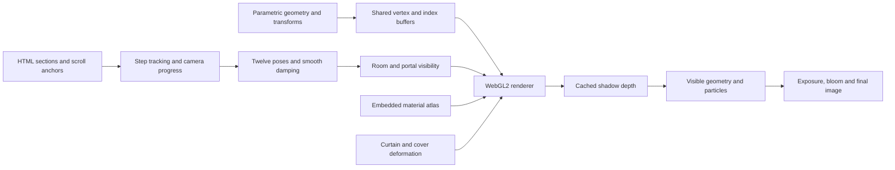

# Inside the renderer

The application is a static document with a custom WebGL2 engine. Its deployable artifact is `index.html`; the other files support development, diagnostics, and documentation.

## From document to image



## Single-file runtime

The HTML contains the layout, Scripture text, SVG floor plan, CSS, JavaScript engine, shader strings, and base64-encoded PNG atlas. There is no module loader, runtime package manager, model loader, or font request. The page works from a `file:` URL or a static HTTP host.

The source is organized into seven engine sections:

| Section | Responsibility |
| --- | --- |
| A · Data | Walkthrough labels, map markers, reduced-motion preference |
| B · Math | Vectors, matrices, transforms, easing, noise |
| C · Geometry builders | Parametric primitives, transform stack, material and motion attributes |
| D · Scene | Sanctuary dimensions, furnishings, world assembly, room visibility |
| E · Renderer | GLSL programs, textures, buffers, framebuffer passes, particles |
| F · Camera | Twelve positions, targets, fields of view, exposure and composition offsets |
| G · Page UI | Controls, layout measurement, scroll mapping, render loop and quality adaptation |

TypeScript is confined to development verification. A browser cannot execute TypeScript type syntax in an ordinary `<script>` block; the inline runtime is JavaScript.

## Mesh layout

`buildScene()` generates **43,196 vertices** and **56,268 triangles**. Every vertex contains 15 floating-point values:

```text
position.xyz | normal.xyz | uv.xy | color.rgb | roughness | metallic | pattern | emission
     3             3         2         3           1           1          1         1
```

A separate four-float motion buffer assigns surfaces to a deformation group. Static geometry uses group zero. Three groups move the gate, entrance, and veil panels; the fourth rotates the ark's cover and attached cherubim.

Geometry shares GPU buffers. Index ranges are grouped by room visibility masks and submitted through separate indexed draws. The complete scene is therefore not necessarily a single draw call.

## Room visibility

Exterior, Holy Place, and Most Holy Place use bit masks `1`, `2`, and `4`. Door apertures are projected and clipped before perspective division. Adjacent rooms remain visible when the opening appears in the current view; a crossing margin prevents popping near a doorway. Closed curtains restrict traversal. Looking backward through both open doors can retain all three rooms.

The shadow pass retains all potential casters, including geometry culled from the main view. Animated surface deformation is shared by the visible and depth shaders so moving curtains cast matching shadows.

Examples produced by the diagnostic checks:

| Camera pose | Submitted triangles | Complete scene |
| --- | ---: | ---: |
| Hero outside | 34,930 | 56,268 |
| Holy Place | 17,364 | 56,268 |
| Ark interior | 14,580 | 56,268 |

These are geometry submission counts, not FPS measurements.

## Rendering and materials

The renderer selects an inexpensive shader or a detailed shader according to quality. The detailed path combines a metallic/roughness microfacet BRDF, directional lighting, interior light sources, filtered shadow sampling, ambient reflection approximations, and surface-oriented relief. Particle passes render flames, smoke, and atmospheric detail.

High quality lazily decodes the embedded **1536 × 1024** atlas into six **512 × 512** texture-array layers: sand, linen, acacia, gold, bronze, and hide. Mipmaps and optional anisotropic filtering reduce shimmer. Texture luminance modulates the material color; roughness and relief are inferred from the imagery. These are generated diffuse textures, not measured physical material scans.

HDR, antialiasing, and bloom paths depend on available WebGL capabilities and the selected quality. The engine uses framebuffer passes rather than a scene library's postprocessing system.

## Quality and frame pacing

| Setting | Desktop particle budget | Material atlas | Shadows and bloom |
| --- | ---: | --- | --- |
| Low | 70 | Procedural patterns | Disabled |
| Medium | 140 | Procedural patterns | Disabled |
| High | 260 | Six texture layers | Enabled where supported |

Mobile budgets are lower. Auto chooses an initial profile from platform hints, then adjusts resolution and profile from measured rendered-frame timing. Manual profile selection still permits resolution adaptation within that profile's bounds.

The render loop skips hidden documents. Reduced-motion preference removes decorative drift and avoids continuous rendering when the view is settled. Detected software rendering is capped at approximately 30 FPS. Camera damping uses elapsed time, so its response does not depend on an assumed frame rate.

## Document navigation

Nine cards correspond to the courtyard gate, sacrifice altar, laver, menorah, bread table, incense altar, Most Holy Place, ark, and ark interior. The map has eight physical markers; step nine highlights the ark marker while retaining its own legend entry.

Layout measurements are cached and invalidated on resize, font readiness, and page size changes. A scroll event schedules a coalesced update rather than repeatedly reading all rectangles inside the animation loop. The selected card, pill, legend item, and map marker share the same active step. An IntersectionObserver updates the top navigation; content reveals use a separate rectangle sweep.

The page supports previous/next buttons, left/right arrow keys, a skip link, Arabic text isolation, reduced-motion styles, and print styles. If WebGL2 is unavailable, the 3D toggle is disabled and the CSS background keeps the document readable.

## Verification boundaries

The Node checks inspect real generated geometry and exercise material-upload and draw-call behavior with simulated graphics APIs. They cannot establish visual correctness or GPU performance. The TypeScript Playwright test complements them by compiling shaders in a browser and exercising the actual document. Screenshots show the captured browser output, not a separate render or marketing mockup.
